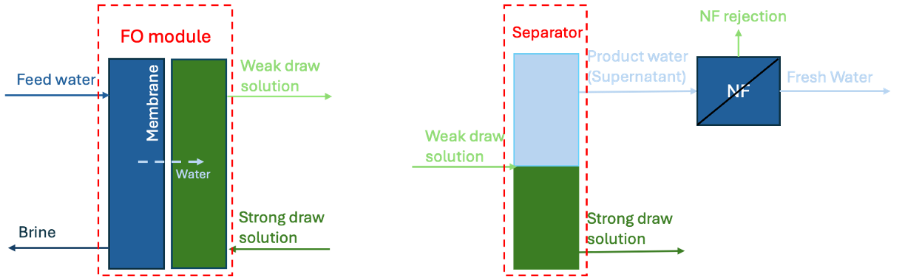

.. _FO_homepage:

Forward Osmosis (FO)
====================

This Forward Osmosis (FO) unit model
   * supports steady-state only
   * is a assumed-performance zero-order model
   * is verified against the Trevi's operational data and modeling results

    Figure 1. Diagram of the FO unit model

This FO model is constructed based on the Trevi System's FO pilot plant configuration. The extraction of water from the feed flow 
relies on a bi-phasic synthetic polymer draw agent that is either a hydrophilic liquid or a hydrophobic liquid depending on 
temperature. In its hydrophilic state, this agent draws water across a semi-permeable membrane by osmotic pressure. Once the draw has 
been diluted by the fresh water crossing the FO membrane, the draw mixture is heated, causing it to become hydrophobic and release water. 
The water and draw polymer are separated in a traditional “oil/water” coalescer (separator), and a polishing nano-filtration (NF) membrane further 
purifies the product stream by removing stray polymer. The associated draw solution package is used to simulate the mass and thermal energy 
transfer within the process.

At the technical heart of referenced Trevi' system, two counter-flow heat exchangers recover process heat from both the draw and purified 
water streams – transferring heat directly to the dilute draw as it exits the osmosis membrane cartridges. The full configuration is constructed 
in an example flowhsheet: :any:`Trevi_FO_homepage`

Degrees of Freedom
------------------
The FO model has 6 degrees of freedom that should be fixed for the unit to be fully specified.

Typically, the following variables are fixed, including the state variables at the inlet and other configurations of the system. 

.. csv-table::
   :header: "State Variables", "Variable name", "Symbol", "Unit"

   "Feed salinity", "feed_props.conc_mass_phase_comp['Liq', 'TDS']", ":math:`s_{feed}`", ":math:`\text{g/}\text{L}`"
   "Feed temperature", "feed_props.temperature", ":math:`T_{f}`", ":math:`^o\text{C}`"
   "Feed volume flow rate", "feed_props.flow_vol_phase['Liq']", ":math:`v_{feed}`", ":math:`\text{m}^3 / \text{s}`"
   "Strong draw solution (A) mass fraction", "strong_draw_props.mass_frac_phase_comp['Liq', 'DrawSolution']", ":math:`x_{A}`", "None"
   "Strong draw solution temperature entering FO", "strong_draw_props.temperature", ":math:`T_{A}`", ":math:`^o\text{C}`"
   "Draw solution mass fraction in product water (P)", "product_props.mass_frac_phase_comp['Liq', 'DrawSolution']", ":math:`x_{P}`", "None"

Model Structure
---------------

This FO model consists of 6 StateBlocks (as 6 Ports in parenthesis below).

* Feed flow (feed)
* Product water (product)
* Brine flow (brine)
* Strong draw solution (strong_draw)
* Weak draw solution (weak_draw)
* Regenerated draw solution (reg_draw)

Feed and brine stateblocks are associated with seawater property package, while the other 4 stateblocks use the specific 
draw solution package.

Variables
---------
The system configuration variables can be fixed with the default values:

.. csv-table::
   :header: "System configurations", "Variable name", "Symbol", "Unit"

   "Heat of mixing in membrane (per m3 of product water)", "heat_mixing", ":math:`\Delta H_{mixing}`", ":math:`\text{MJ/}\text{m}^3`"
   "Separation temperature of the draw solution", "regeneration_temp", ":math:`T_{separation}`", ":math:`^o\text{C}`"
   "Temperature loss in the separator", "separator_temp_loss", ":math:`\Delta T_{separator}`", ":math:`^o\text{C}`"
   "Required pressure over brine osmotic pressure", "dp_brine", ":math:`\Delta P_{brine}`", ":math:`\text{Pa}`"
   "FO recovery ratio",  "recovery_ratio", ":math:`RR_{FO}`", "None"
   "NF recovery ratio",  "nanofiltration_recovery_ratio", ":math:`RR_{NF}`", "None"

The following variables are calculated by fixing the default degree of freedoms above.

.. csv-table::
   :header: "Description", "Symbol", "Variable Name", "Units"

   "Heat of mixing transferred to brine (per m3 of product water)", ":math:`\Delta H_{mixing\_to\_brine}`", "heat_transfer_to_brine",  ":math:`\text{MJ/}\text{m}^3`"
   "Heat of mixing transferred to the weak draw (per m3 of product water)", ":math:`\Delta H_{mixing\_to\_weak}`", "heat_transfer_to_weak",  ":math:`\text{MJ/}\text{m}^3`"
   "Temperature difference between membrane and outlet flows due to the released heat of mixing", ":math:`\Delta T_{membrane}`", "delta_temp_membrane",  ":math:`^o\text{C}`"
   "FO Membrane temperature", ":math:`T_{membrane}`", "membrane_temp",  ":math:`^o\text{C}`"

Equations
---------
.. csv-table::
   :header: "Description", "Equation"

   "Brine volumetric flow rate", ":math:`v_{brine} = v_{feed} \times  (1 - \frac{RR_{FO}}{RR_{NF}})`"
   "Brine salinity", ":math:`s_{brine} = \frac{s_{feed}}{1 - \frac{RR_{FO}}{RR_{NF}}}`"
   "Brine temperature", ":math:`T_{brine} = T_{membrane} + \Delta T_{membrane}`"
   "Product water volumetric flow rate", ":math:`v_{product} = v_{feed} \times \frac{RR_{FO}}{RR_{NF}}`"
   "Weak draw solution (B) temperature (same as brine temp)", ":math:`T_{B} = T_{membrane} + \Delta T_{membrane}`"
   "Heat of mixing transferring to brine and weak draw", ":math:`\Delta H_{mixing} = \Delta H_{mixing\_to\_brine} + \Delta H_{mixing\_to\_weak}`"
   "Heat of mixing transferring to brine", ":math:`\Delta H_{mixing\_to\_brine} = \Delta T_{membrane} \times \rho_{brine} \times v_{brine} \times Cp_{brine}`"
   "Heat of mixing transferring to weak draw", ":math:`\Delta H_{mixing\_to\_weak} = \Delta T_{membrane} \times \rho_{B} \times v_{B} \times Cp_{B}`"
   "Membrane temperature", ":math:`T_{membrane} = \frac{\rho_{A}*v_{A}*Cp_{A}*T_{A} + \rho_{feed}*v_{feed}*Cp_{feed}*T_{feed}}{\rho_{A}*v_{A}*Cp_{A} + \rho_{feed}*v_{feed}*Cp_{feed}}`"
   "Required osmotic pressure of weak draw", ":math:`P_{osm\_B} = P_{osm\_brine} + \Delta P_{brine}`"
   "Regenerated draw solution temperature", ":math:`T_{reg} = T_{separation} - \Delta T_{separator}`"

References
----------

Documentation, data and Excel model from Trevi System.