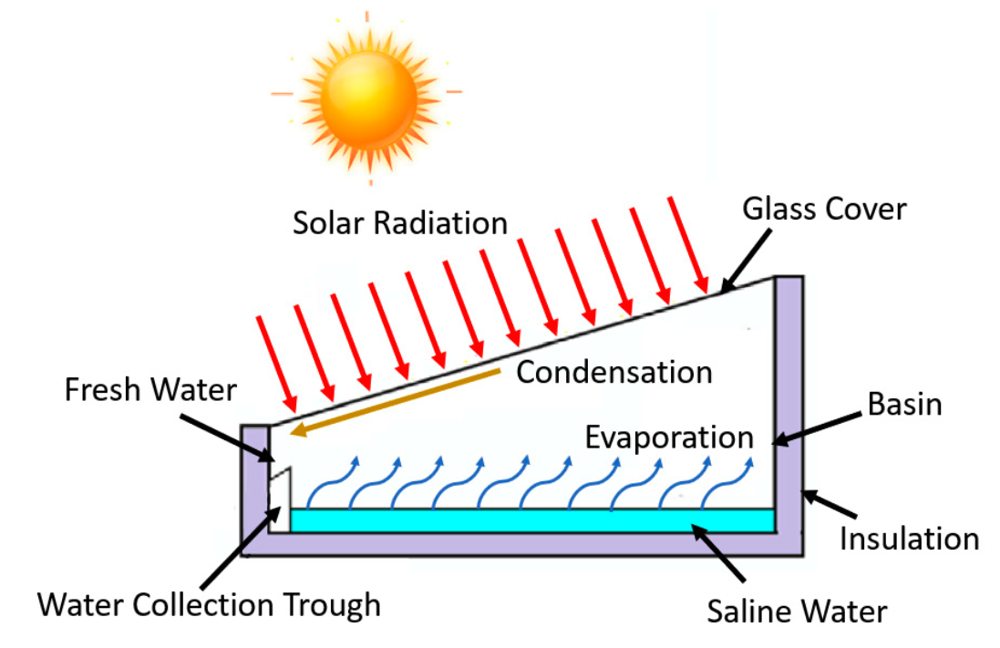

.. _solar_still_ref:

Solar Still
===========

.. code-block:: python

    from watertap_contrib.reflo.unit_models import SolarStill

Solar stills use solar energy to evaporate water, leaving contaminants behind.
They are often used in remote areas where access to electricity is limited but solar energy and space is abundant.
Solar stills consist of an insulated basin filled with saline/brackish water, heated by solar radiation, promoting evaporation. 
The condensed and purified water collects on the inclined glass lid for consumption. Though SS produces high-quality water, 
its production is limited, making it suitable particularly for small-scale applications. 

    Figure 1. Solar still schematic, from Johnson et al. (2019).

Model Structure
---------------

The solar still is assumed to be a batch process where the basins are filled to a certain depth and then allowed to fully empty 
before starting the next batch cycle. At the core of the solar still model is the calculation of the length of the batch cycle and the water yield.
For each hour in the day, the model calculates various parameters as a function of the atmospheric conditions and the thermophysical properties 
of the water in the basin. Based on the user-defined initial conditions, it determines how long it takes
for the water level to drop below a certain threshold, indicating the end of the solar still batch operation.
The duration of the batch operation is then used to calculate the total water yield for the system, and calculates the
total area required to meet a user-defined daily water production target.

The solar still model uses the `MCAS property package <https://watertap.readthedocs.io/en/stable/technical_reference/property_models/mc_aq_sol.html>`_.
The model consists of 3 StateBlocks (with 3 Ports in parenthesis below).

* Feed flow (``inlet``)
* Product water (``outlet``)
* Waste flow (``waste``)

Model Configuration
-------------------

The water yield calculation occurs at the time the moment the model is instantiated, so initial conditions are passed as a dictionary via 
the ``water_yield_calculation_args`` configuration argument with the following key-value pairs:

.. csv-table::
    :header: "Key", "Description", "Units", "Default Value"

    "``input_weather_file_path``", "Path to a CSV file that contains hourly weather data for the location of interest. See details below.","N/A", "None"
    "``initial_salinity``", "Initial salinity of the water in the basin. This should correspond to the inlet salinity set on the inlet Port.",":math:`\text{g/L}`", "200"
    "``initial_water_basin_depth``", "Initial depth of the water in the basin", ":math:`\text{m}`", "0.1"
    "``length_basin``", "Length of the basin. It is assumed that the length and width of the basin are the same", ":math:`\text{m}`", "0.6"
    "``irradiance_threshold``", "Irradiance threshold below which the the irradiance is assumed to have negligible impact on calculation.", ":math:`\text{W/m}^2`", "0"
    "``irradiance_col``", "Column name in the weather data file that contains the global horizontal irradiance (GHI) data", "N/A", "GHI"
    "``temperature_col``", "Column name in the weather data file that contains the ambient temperature data.", "N/A", "Tdry"
    "``wind_velocity_col``", "Column name in the weather data file that contains the wind speed data", "N/A", "Wspd"

Weather File
++++++++++++

Users must also provide a weather data file that contains hourly weather data for the location of interest.
The weather data file must be a CSV file that contains the following columns:

.. csv-table::
   :header: "Column Name", "Description", "Units"

   "GHI", "Global horizontal irradiance", ":math:`\text{W/m}^2`"
   "Ambient Temperature", "Ambient air temperature", ":math:`\text{°C}`"
   "Wind Speed", "Wind speed at 10 m height", ":math:`\text{m/s}`"

The weather data file can be downloaded from the `National Solar Radiation Database <https://nsrdb.nrel.gov/data-viewer>`_.
Weather files downloaded from here will have other metadata contained in the first two rows of the file and the data will be 
loaded assuming that the column names are in the third row of the file and the data starts on the fourth row.

The hourly weather data will be converted to arrays for every second of a year, with the hourly values repeated for each second of the hour.
The system is initially assumed to be in thermal equilibrium with the ambient conditions, so the initial temperatures of the sky, glass, basin, 
and saline water are all set to the ambient temperature at the start of the batch.

Degrees of Freedom
------------------

The only degrees of freedom that must be specified for the solar still model are the inlet state variables (i.e., temperature, pressure, component flowrates).

The water yield calculation calculates the following variables for each second of the year:

.. csv-table::
   :header: "Description", "Symbol", "Units"

   "Temperature of the sky", ":math:`T_{sky}`", ":math:`\text{°C}`"
   "Temperature of the basin", ":math:`T_{basin}`", ":math:`\text{°C}`"
   "Temperature of the glass", ":math:`T_{glass}`", ":math:`\text{°C}`"
   "Temperature of saline water", ":math:`T_{sw}`", ":math:`\text{°C}`"
   "Temperature difference inside the basin", ":math:`\Delta T_{inside}`", ":math:`\text{°C}`"
   "Temperature difference outside the basin", ":math:`\Delta T_{outside}`", ":math:`\text{°C}`"
   "Depth of the water in the basin", ":math:`Z`", ":math:`\text{m}`"
   "Mass of water in the basin", ":math:`m_{sw}`", ":math:`\text{kg}`"
   "Mass of salt in the basin", ":math:`m_{salt}`", ":math:`\text{kg}`"
   "Density of saline water :sup:`1`", ":math:`\rho_{sw}`", ":math:`\text{kg/m}^3`"
   "Dynamic viscosity of saline water :sup:`1`", ":math:`\mu`", ":math:`\text{kg/m/s}`"
   "Specific heat of saline water :sup:`1`", ":math:`c_{p}`", ":math:`\text{kJ/kg/K}`"
   "Thermal conductivity of saline water :sup:`1`", ":math:`k`", ":math:`\text{W/m/K}`"
   "Kinematic viscosity of saline water", ":math:`\nu`", ":math:`\text{m}^2/\text{s}`"
   "Latent heat of vaporization of water", ":math:`h_{fg}`", ":math:`\text{kJ/kg}`"
   "Activity of saltwater", ":math:`a_{sw}`", ":math:`\text{dimensionless}`"
   "Partial saturated vapor pressure of water at saline water temperature", ":math:`P_{sw}`", ":math:`\text{Pa}`"
   "Partial saturated vapor pressure of water at glass temperature", ":math:`P_{a}`", ":math:`\text{Pa}`"
   "Coefficient of volume expansion of water", ":math:`\beta`", ":math:`\text{K}^{-1}`"
   "Prandtl number", ":math:`\text{Pr}`", ":math:`\text{dimensionless}`"
   "Grashof number", ":math:`\text{Gr}`", ":math:`\text{dimensionless}`"
   "Heat transfer coefficient of water layer", ":math:`h_{sw}`", ":math:`\text{W/m}^2/\text{K}`"
   "Convective heat transfer coefficient between water and glass", ":math:`h_{c,water-glass}`", ":math:`\text{W/m}^2/\text{K}`"
   "Radiative heat transfer coefficient between water and glass", ":math:`h_{r,water-glass}`", ":math:`\text{W/m}^2/\text{K}`"
   "Evaporative heat transfer coefficient between water and glass", ":math:`h_{e,water-glass}`", ":math:`\text{W/m}^2/\text{K}`"
   "Total heat transfer coefficient between water and glass", ":math:`h_{water-glass}`", ":math:`\text{W/m}^2/\text{K}`"
   "Radiative heat transfer coefficient between glass and ambient", ":math:`h_{r,glass-amb}`", ":math:`\text{W/m}^2/\text{K}`"
   "Convective heat transfer coefficient between glass and ambient", ":math:`h_{c,glass-amb}`", ":math:`\text{W/m}^2/\text{K}`"
   "Convective heat transfer coefficient between basin and ambient", ":math:`h_{c,basin-amb}`", ":math:`\text{W/m}^2/\text{K}`"
   "Total heat transfer coefficient between glass and ambient", ":math:`h_{glass-amb}`", ":math:`\text{W/m}^2/\text{K}`"
   "Total heat transfer coefficient between basin and ambient", ":math:`h_{basin-amb}`", ":math:`\text{W/m}^2/\text{K}`"
   "Effective overall absorptivity of the basin", ":math:`\alpha_{eff}`", ":math:`\text{dimensionless}`"
   "Overall heat loss coefficient between glass and ambient", ":math:`U_{glass-amb}`", ":math:`\text{W/m}^2/\text{K}`"
   "Overall heat transfer coefficient between basin bottom and ambient", ":math:`U_{basin-amb}`", ":math:`\text{W/m}^2/\text{K}`"
   "Overall heat loss coefficient between basin bottom and ambient", ":math:`U_{overall}`", ":math:`\text{W/m}^2/\text{K}`"
   "Overall heat loss coefficient from basin sides", ":math:`U_{sides}`", ":math:`\text{W/m}^2/\text{K}`"
   "Overall heat transfer coefficient from basin to ambient", ":math:`U_{total}`", ":math:`\text{W/m}^2/\text{K}`"
   "Evaporated mass of freshwater per unit area", ":math:`m_{evap}`", ":math:`\text{kg/m}^2/\text{s}`"
   "Remaining mass of saline water in the basin", ":math:`m_{sw}`", ":math:`\text{kg}`"
   "Salt concentration in the basin", ":math:`C_{salt}`", ":math:`\text{kg/m}^3`"
   "Mass of salt precipitated", ":math:`m_{salt,precip}`", ":math:`\text{kg}`"

The model uses the following constants in the water yield calculations:

.. csv-table::
    :header: "Description", "Symbol", "Value", "Units"

    "Gravitational constant", ":math:`g`", ":math:`9.81`", ":math:`\text{m/s}^2`"
    "Stefan-Boltzmann constant", ":math:`\sigma`", ":math:`5.6697 \times 10^{-8}`", ":math:`\text{W/m}^2\text{K}^4`"
    "Thickness of solar still insulation", ":math:`x_{insul}`", ":math:`0.005`", ":math:`\text{m}`"
    "Thermal conductivity of solar still insulation", ":math:`k_{insul}`", ":math:`0.033`", ":math:`\text{W/m/K}`"
    "Thickness of glass cover", ":math:`x_{glass}`", ":math:`0.004`", ":math:`\text{m}`"
    "Thermal conductivity of glass cover", ":math:`k_{glass}`", ":math:`1.03`", ":math:`\text{W/m/K}`"
    "Density of NaCl solid", ":math:`\rho_{salt}`", ":math:`2165`", ":math:`\text{g/L}`"
    "Density of freshwater", ":math:`\rho_{fw}`", ":math:`1000`", ":math:`\text{g/L}`"
    "Maximum solubility of NaCl in water", ":math:`C_{salt,max}`", ":math:`365`", ":math:`\text{g/L}`"
    "Adsorptivity of glass cover", ":math:`\alpha_{glass}`", ":math:`0.047`", ":math:`\text{dimensionless}`"
    "Adsorptivity of water surface", ":math:`\alpha_{water}`", ":math:`0.20`", ":math:`\text{dimensionless}`"
    "Adsorptivity of basin", ":math:`\alpha_{basin}`", ":math:`0.65`", ":math:`\text{dimensionless}`"
    "Reflectivity of glass cover", ":math:`R_{glass}`", ":math:`0.047`", ":math:`\text{dimensionless}`"
    "Reflectivity of water surface", ":math:`R_{water}`", ":math:`0.08`", ":math:`\text{dimensionless}`"
    "Emissivity of glass cover", ":math:`\epsilon_{glass}`", ":math:`0.94`", ":math:`\text{dimensionless}`"
    "Emissivity of water surface", ":math:`\epsilon_{water}`", ":math:`0.95`", ":math:`\text{dimensionless}`"

The absorptivity, reflectivity, and emissivity values are then used to calculate effective parameters for different parts of the 
solar still basin:

.. csv-table::
    :header: "Description", "Symbol", "Units", "Equation"

    "Effective emissivity between glass and water surface", ":math:`\epsilon_{effective}`", ":math:`\text{dimensionless}`", ":math:`\cfrac{1}{\left( \cfrac{1}{\epsilon_{glass}} + \cfrac{1}{\epsilon_{water}} - 1 \right)}`"
    "Effective absorptivity of solar radiation absorbed by water", ":math:`\alpha_{water,eff}`", ":math:`\text{dimensionless}`", ":math:`\alpha_{water} \left(1 - \alpha_{glass}\right) \left(1 - R_{glass}\right) \left(1 - R_{water} \right)`"
    "Effective absorptivity of solar radiation absorbed by basin", ":math:`\alpha_{basin,eff}`", ":math:`\text{dimensionless}`", ":math:`\alpha_{basin} \left(1 - \alpha_{glass}\right) \left(1 - R_{glass} \right) \left(1 - \alpha_{water} \right) \left(1 - R_{water} \right)`"
    "Effective absorptivity of solar radiation absorbed by glass", ":math:`\alpha_{glass,eff}`", ":math:`\text{dimensionless}`", ":math:`\alpha_{glass} \left(1 - R_{glass} \right)`"

The model also includes the following variables, parameters, and expressions on the unit model block:

.. csv-table::
    :header: "Description", "Variable Name", "Symbol", "Default Value or Equation", "Units"

    "Number of ZLD cycles per year :sup:`2`", "``num_zld_cycles``", ":math:`N_{ZLD}`", "N/A", ":math:`\text{year}^{-1}`"
    "Length of the basin :sup:`2`", "``length_basin``", ":math:`L`", "0.6", ":math:`\text{m}`"
    "Average daily mass water yield per unit area :sup:`2`", "``water_yield``", ":math:`Y_{fw}`", "N/A", ":math:`\text{kg/m}^2\text{/day}`"
    "Density of dried salts", "``dens_mass_salt``", ":math:`\rho_{salt,dry}`", "2.16", ":math:`\text{g/cm}^3`"
    "Total area of solar stills required", "``total_area``", ":math:`A_{basin,tot}`", ":math:`\cfrac{m_{out,water}}{Y_{fw}}`", ":math:`\text{m}^2`"
    "Duration of one ZLD cycle", "``length_zld_cycle``", ":math:`t_{batch}`", ":math:`N_{ZLD}^{-1}`", ":math:`\text{day}`"
    "Annual water yield per unit area", "``annual_water_yield``", ":math:`Y_{fw,annual}`", ":math:`\cfrac{Y_{fw}}{\rho_{in,water}}`", ":math:`\text{m}^3\text{/m}^2`"
    "Volumetric flow of salts", "``flow_vol_salt``", ":math:`q_{salt}`", ":math:`\cfrac{\sum_{j} m_{waste,j}}{\rho_{salt, dry}}`", ":math:`\text{m}^3/\text{s}`"
    "Deposition rate of salts", "``deposition_rate``", ":math:`r_{salt,dep}`", ":math:`\cfrac{q_{salt}}{A_{basin,tot}}`", ":math:`\text{kg/m}^2/\text{s}`"
    "Area of single solar still", "``area_single_still``", ":math:`A_{basin}`", ":math:`L^2`", ":math:`\text{m}^2`"
    "Yield per still", "``yield_per_still``", ":math:`Y_{fw,basin}`", ":math:`Y_{fw}  A_{basin}`", ":math:`\text{kg/s}`"
    "Evaporation rate per unit area", "``evaporation_rate``", ":math:`m_{evap}`", ":math:`\cfrac{Y_{fw}}{\rho_{out,water}}`", ":math:`\text{mm/day}`"
    "Number of solar stills required", "``number_stills``", ":math:`N_{stills}`", ":math:`\cfrac{A_{basin,tot}}{A_{basin}}`", ":math:`\text{dimensionless}`"

:sup:`1` These thermophysical properties of salt water (density, dynamic viscosity, specific heat, thermal conductivity) are calculated using the correlations from Sharqawy et al. (2010).
:sup:`2` These parameters are calculated as part of the water yield calculation during model instantiation and the values are set afterwards.

Equations
---------

The water yield calculation is executed as part of model instantiation. Prior to starting the water yield calculation, the initial 
masses of salt and water are calculated. We assume the mass of salt water is the sum of the mass of salt and the mass of fresh water:

.. math::

    m_{sw, t_0} = m_{salt, t_0} + m_{fw, t_0}

The initial mass of salt is calculated from the initial density and volume of salt water in the basin.

.. math::

    m_{sw,t_0} = Z A_{basin} \rho_{sw,t_0}

Then the initial mass of fresh water and salt is calculated from the mass balance:

.. math::

    m_{fw,t_0} = \cfrac{m_{sw,t_0}}{1 + \cfrac{C_{salt,t_0}}{\rho_{fw}}}

.. math::

    m_{salt,t_0} = C_{salt,t_0} \cfrac{m_{sw,t_0}}{\rho_{fw}}

After loading the weather data and creating the necessary arrays,
the model calculates the following parameters in this order for each second of the year (:math:`t`):

.. csv-table::
    :header: "Description", "Equation"

    "Temperature difference inside the basin", ":math:`\Delta T_{inside,t} = T_{sw,t-1} - T_{glass,t-1}`"
    "Temperature difference outside the basin", ":math:`\Delta T_{outside,t} = T_{glass,t-1} - T_{ambient,t-1}`" 
    "Temperature of the sky", ":math:`T_{sky,t} = 0.0552 \left( T_{ambient}^{1.5} \right)`"
    "Area of the water contacting the basin side", ":math:`A_{side, t} = 2 (2L) Z_{t-1}`"
    "Saltwater density", ":math:`\rho_{sw,t} = f\left(C_{salt,t-1}, T_{sw,t-1}\right)`" 
    "Saltwater dynamic viscosity", ":math:`\mu_{sw,t} = f\left(C_{salt,t-1}, T_{sw,t-1}\right)`" 
    "Saltwater specific heat", ":math:`c_{p,sw,t} = f\left(C_{salt,t-1}, T_{sw,t-1}\right)`"
    "Saltwater thermal conductivity", ":math:`k_{sw,t} = f\left(C_{salt,t-1}, T_{sw,t-1}\right)`"
    "Saltwater kinematic viscosity", ":math:`\nu_t = \cfrac{\mu_{sw,t}}{\rho_{sw,t}}`"
    "Prandtl number", ":math:`\text{Pr}_{t} = \cfrac{c_{p,sw,t} \mu_{sw,t}}{k_{sw,t}}`"
    "Latent heat of vaporization of pure water", ":math:`h_{fg} = \left( 2501.67 - 2.389 T_{sw,t-1}\right)`"
    "Water activity", ":math:`a_{sw,t} = -0.000537 C_{salt,t-1} + 0.9985307`"
    "Partial saturated vapor pressure of water at saline water temperature", ":math:`P_{sw,t} = a_{sw,t} \times \text{exp}{\left(  25.317 - \cfrac{5144}{(T_{sw,t-1} + 273)} \right)}`"
    "Partial saturated vapor pressure of water at glass temperature", ":math:`P_{glass,t} = a_{sw,t} \times \text{exp}{\left(  25.317 - \cfrac{5144}{(T_{glass,t-1} + 273)} \right)}`"
    "Coefficient of volume expansion of water", ":math:`\beta_{t} = -0.000006 \times T_{sw,t-1}^4 + 0.001667 \times T_{sw,t-1}^3 - 0.197796 \times T_{sw,t-1}^2 + 16.862446 \times T_{sw,t-1} - 64.319951`"
    "Grashof number", ":math:`\text{Gr}_{t} = \cfrac{g \beta_{t} (T_{basin,t-1} - T_{sw,t-1}) Z_{t-1}^3}{\nu_t^2}`"
    "Heat transfer coefficient of water layer", ":math:`h_{sw,t} = 0.54 \cfrac{k}{Z_{t-1}} \left(\text{Pr}_{t} \text{Gr}_{t}\right)^{0.25}`"
    "Convective heat transfer coefficient between water and glass", ":math:`h_{c,water-glass,t} = 0.884 \left( (T_{sw,t-1} - T_{glass,t-1}) + \left( \cfrac{(P_{sw,t} - P_{glass,t})(T_{sw,t-1} + 273.15)}{268900 - P_{sw,t}} \right)  \right)^{1/3}`"
    "Radiative heat transfer coefficient between water and glass", ":math:`h_{r,water-glass,t} = \sigma \epsilon_{water} \left( (T_{sw,t-1} + 273.15)^2 + (T_{glass,t-1} + 273.15)^2  \left( T_{sw,t-1} + T_{glass,t-1} + 546 \right) \right)`"
    "Evaporative heat transfer coefficient between water and glass", ":math:`h_{e,water-glass,t} = 0.01628 \times h_{c,water-glass,t} \times \cfrac{P_{sw,t} - P_{glass,t}}{\Delta T_{inside, t}}`"
    "Total heat transfer coefficient between water and glass", ":math:`h_{water-glass,t} = h_{c,water-glass,t} + h_{r,water-glass,t} + h_{e,water-glass,t}`"
    "Radiative heat transfer coefficient between glass and ambient", ":math:`h_{r,glass-amb,t} = \sigma \epsilon_{glass}  \left( \cfrac{(T_{glass,t-1} + 273.15)^4 - (T_{sky,t-1} + 273.15)^4}{\Delta T_{outside, t}} \right)`"
    "Convective heat transfer coefficient between glass and ambient", ":math:`h_{c,glass-amb,t} = 2.8 + \left( 3.0 \times V_{wind,t}\right) \text{ if } V_{wind,t} <5 \text{ else } = 2.8 + \left( 3.8 \times V_{wind,t}\right)`"
    "Convective heat transfer coefficient between basin and ambient", ":math:`h_{c,basin-amb,t} = 2.8 + \left( 3.0 \times V_{wind,t}\right) \text{ if } V_{wind,t} <5 \text{ else } = 2.8 + \left( 3.8 \times V_{wind,t}\right)`"
    "Total heat transfer coefficient between glass and ambient", ":math:`h_{glass-amb,t} = h_{r,glass-amb,t} + h_{c,glass-amb,t}`"
    "Total heat transfer coefficient between basin and ambient", ":math:`h_{basin-amb,t} = \cfrac{1}{\cfrac{ x_{insul} }{ k_{insul} } + \cfrac{1}{ h_{c,basin-amb,t} }}`"
    "Effective overall absorptivity of the basin", ":math:`\alpha_{eff} = \alpha_{basin,eff} \cfrac{h_{sw,t}}{h_{sw,t} + h_{basin-amb,t} + h_{c,basin-amb,t}}+ \alpha_{water,eff} + \alpha_{glass,eff} \left( \cfrac{h_{water-glass,t}}{h_{water-glass,t} + h_{glass-amb,t}} \right)`"
    "Overall heat loss coefficient between glass and ambient", ":math:`U_{glass-amb,t} = \cfrac{ \cfrac{k_{glass}}{x_{glass}} h_{glass-amb,t} } { \cfrac{k_{glass}}{x_{glass}}+h_{glass-amb,t}}`"
    "Overall heat transfer coefficient between basin bottom and ambient", ":math:`U_{basin-amb,t} = \cfrac{ h_{water-glass,t} U_{glass-amb,t}} { h_{water-glass,t} + U_{glass-amb,t}}`"
    "Overall heat loss coefficient between basin bottom and ambient", ":math:`U_{overall,t} = \cfrac{ h_{sw,t} h_{basin-amb,t}} { h_{sw,t} + h_{basin-amb,t}}`"
    "Overall heat loss coefficient from basin sides", ":math:`U_{sides,t} = \cfrac{A_{side}}{A_{bottom}} U_{overall,t}`"
    "Overall heat transfer coefficient from basin to ambient", ":math:`U_{total,t} = U_{overall,t} + U_{sides,t}`"
    "Overall external heat transfer coefficient", ":math:`U_{external,t} = U_{basin-amb,t} + U_{total,t}`"
    "Grouping term for energy balance", ":math:`\phi_t = \cfrac{U_{external,t}}{m_{sw,t-1} c_{p,sw,t}}`"
    "Time dependent term for energy balance", ":math:`\tau_t = \cfrac{\left( \alpha_{eff} \times \text{GHI} \right) + \left(U_{external,t} T_{ambient,t} \right)}{m_{sw,t-1} c_{p,sw,t}}`"
    "Saline water temperature", ":math:`T_{sw,t} = \left( \cfrac{\tau_t}{\phi_t} \right) \left( 1 - \text{exp} \left(-\phi_t t \right) \right) + \left( T_{sw,t-1} \text{exp} \left(-\phi_t t \right) \right)`"
    "Glass temperature", ":math:`T_{glass,t} = \cfrac{ \alpha_{glass,eff} \text{GHI} + h_{water-glass,t} T_{sw,t-1} +  U_{glass-amb,t} T_{ambient,t}}{h_{water-glass,t} + U_{glass-amb,t}}`"
    "Basin temperature", ":math:`T_{basin,t} = \cfrac{ \alpha_{basin,eff} \text{GHI} + h_{sw,t} T_{sw,t-1} + (h_{basin-amb,t} + h_{c,basin-amb,t}) T_{basin,t-1}}{h_{sw,t} + U_{basin-amb,t} + h_{c,basin-amb,t}}`"
    "Evaporated mass of freshwater per unit area", ":math:`m_{fw,evap,t} = \cfrac{A_{basin} h_{e,water-glass,t} \Delta T_{inside}}{h_{fg}}`"
    "Evaporated mass of saltwater per unit area", ":math:`m_{sw,evap,t} = \cfrac{m_{fw,evap,t}}{1 + \cfrac{C_{salt,t-1}}{\rho_{fw}}}`"
    "Remaining mass of freshwater in the basin", ":math:`m_{fw,t} = m_{fw,t-1} - m_{sw,evap,t}`"
    "Remaining mass of saltwater in the basin", ":math:`m_{sw,t} = m_{fw,t} + m_{salt,t_0}`"
    "Depth of water in the basin", ":math:`Z_t = \cfrac{m_{sw,t}}{\rho_{sw,t} A_{basin}}`"
    "Salt concentration in the basin :sup:`2`", ":math:`C_{salt,t} = \cfrac{m_{salt,t_0} \rho_{fw}}{m_{fw,t}}`"
    "Excess salinity that precipitates", ":math:`m_{salt,precip,t} = \text{max} \left( 0, (C_{salt,t} - C_{salt,max}) \times \cfrac{m_{fw,t}}{\rho_{fw}} \right)`"

.. note:: 
   :sup:`2` This is the break point in the calculation where the model checks if the water depth is \<= 0 or if all the water has evaporated.

For each second in the year, the model will check if either the depth of water in the basin is \<= 0 of if all the water has been evaporated.
If either of these conditions are met, the model will stop the water yield calculation and the length of the batch is the number of seconds that have passed (i.e., :math:`t_{batch} = t`).
This is used to calculate the number of batch cycles per year:

.. math::

   N_{ZLD} = \cfrac{31536000}{t_{batch}}

The total water yield per year is then calculated as:

.. math::

    Y_{fw} = \cfrac{m_{fw,t0} N_{ZLD}}{A_{basin}}

The model assumes that all of the water that evaporates is collected as product water:

.. math::

    m_{out,water} = m_{in,water}

And that all other components :math:`j` remain in the waste stream:

.. math::

    m_{waste,j} = m_{in,j}

Implicitly then, the salt concentration in the product water is 0 g/L and the mass of water in the waste stream is zero.
Finally, the model calculates the required area of the solar still based on the volumetric flow rate:

.. math::

   A_{basin,tot} = \cfrac{m_{out,water}}{Y_{fw}}

Costing
----------

The following parameters are constructed on the costing block for solar still:

.. csv-table::
    :header: "Cost Component", "Variable", "Symbol", "Value", "Units", "Description"

    "Base number of stills", "``number_solar_stills_base``", ":math:`N_{base}`", "25000", ":math:`\text{dimensionless}`", "Base number of stills to scale cost"
    "Cost per still, base parameter", "``cost_per_still_A_param``", ":math:`A_{still}`", "300.65", ":math:`\text{USD2020}`", "Cost per still equation parameter A"
    "Cost per still, exponent", "``cost_per_still_b_param``", ":math:`b_{still}`", "-0.199", ":math:`\text{dimensionless}`", "Cost per still equation parameter b"
    "Number pumps, base parameter", "``number_pumps_A_param``", ":math:`A_{pumps}`", "0.0097", ":math:`\text{dimensionless}`", "Number pumps equation parameter A"
    "Number pumps, exponent", "``number_pumps_b_param``", ":math:`b_{pumps}`", "0.4729", ":math:`\text{dimensionless}`", "Number pumps equation parameter b"
    "Cost of saltwater pump", "``cost_saltwater_pump``", ":math:`c_{sw}`", "1297", ":math:`\text{USD2020}`", "Cost of single saltwater pump"
    "Cost of freshwater pump", "``cost_freshwater_pump``", ":math:`c_{fw}`", "956", ":math:`\text{USD2020}`", "Cost of single freshwater pump"
    "Cost of piping", "``cost_piping``", ":math:`c_{pipe}`", "4.92", ":math:`\text{USD2020/m}`", "CPVC pipe per linear foot"
    "Pipe length parameter", "``pipe_length_param``", ":math:`X_{pipe}`", "457.2", ":math:`\text{m}`", "Pipe length equation parameter"
    "Cost of feed tank", "``cost_feed_tank_base``", ":math:`c_{ft}`", "1335", ":math:`\text{USD2020}`", "Feed tank capital equation base"
    "Cost of distillate tank", "``cost_dist_tank_base``", ":math:`c_{dt}`", "1406", ":math:`\text{USD2020}`", "Distillate tank capital equation base"
    "Cost of excavation", "``cost_excavation_base``", ":math:`c_{ex}`", "646.33", ":math:`\text{USD2020}`", "Cost excavation base"
    "Saltwater pump efficiency", "``efficiency_saltwater_pump``", ":math:`\eta_{pump,sw}`", "0.70", ":math:`\text{dimensionless}`", "Efficiency of saltwater pump"
    "Freshwater pump efficiency", "``efficiency_freshwater_pump``", ":math:`\eta_{pump,fw}`", "0.70", ":math:`\text{dimensionless}`", "Efficiency of freshwater pump"
    "Fixed OPEX factor", "``fixed_opex_factor``", ":math:`X_{fixed}`", "0.035", ":math:`\text{year}^{-1}`", "Factor for calculating fixed operating costs as a fraction of CAPEX"
    "Labor OPEX factor", "``labor_opex_factor``", ":math:`X_{labor}`", "1", ":math:`\text{USD2020/m}^2\text{/year}`", "Factor for calculating labor operating costs as a function of total solar still area"

These are used the calculate the following capital and operating costs:

.. csv-table::
    :header: "Cost Component", "Symbol", "Equation"

    "Number of saltwater pumps", ":math:`N_{sw}`", ":math:`A_{pumps} N_{stills}^{b_{pumps}}`"
    "Number of freshwater pumps", ":math:`N_{fw}`", ":math:`N_{sw}`"
    "Cost per still", ":math:`C_{still}`", ":math:`A_{still} N_{stills}^{b_{still}}`"
    "Total cost of stills", ":math:`C_{stills,tot}`", ":math:`N_{stills} C_{still}`"
    "Total cost of piping", ":math:`C_{pipe,tot}`", ":math:`c_{pipe} L_{pipe}`"
    "Total cost of saltwater pumps", ":math:`C_{sw,tot}`", ":math:`N_{sw} c_{sw}`"
    "Total cost of freshwater pumps", ":math:`C_{fw,tot}`", ":math:`N_{fw} c_{fw}`"
    "Total cost of feed tank", ":math:`C_{ft}`", ":math:`c_{ft} \cfrac{N_{stills}}{N_{base}}`"
    "Total cost of distillate tank", ":math:`C_{dt}`", ":math:`c_{dt} \cfrac{N_{stills}}{N_{base}}`"
    "Total cost of excavation", ":math:`C_{ex}`", ":math:`c_{ex} \cfrac{N_{stills}}{N_{base}}`"
    "Labor operating cost", ":math:`C_{op,labor}`", ":math:`X_{labor} A_{basin,tot}`"
    "Fixed operating cost", ":math:`C_{op,{fixed}`", ":math:`X_{fixed} C_{total}`"
    "Saltwater pumping power required", ":math:`W_{sw}`", ":math:`\cfrac{\Delta P q_{in}}{\eta_{pump,sw}}`"
    "Freshwater pumping power required", ":math:`W_{fw}`", ":math:`\cfrac{\Delta P q_{in}}{\eta_{pump,fw}}`"
    "Total pumping power required", ":math:`W_{pump}`", ":math:`N_{sw} W_{sw} + N_{fw}W_{fw}`"
    "Length of piping", ":math:`L_{pipe}`", ":math:`X_{pipe} \cfrac{N_{stills}}{N_{base}}`"

The total capital cost of the solar still is the summation of the stills, pumps, piping, tanks, and excavation:

.. math::

   C_{total} = C_{stills,tot} + C_{pipe,tot} + C_{sw,tot} + C_{fw,tot} + C_{ft} + C_{dt} + C_{ex}

The total operating cost of the solar still is the summation of the labor and fixed operating costs:

.. math::

   C_{op,total} = C_{op,labor} + C_{op,fixed}

References
----------

In addition to the model developers own experimental work, the following references were used in developing this model:

| Abujazar, M.S.S.; Fatihah, S.; Rakmi, A.R.; Shahrom, M.Z. (2016)
| The effects of design parameters on productivity performance of a solar still for seawater desalination: A review. 
| Desalination 2016, 385, 178-193, doi:10.1016/j.desal.2016.02.025.

| Agrawal, A., Rana, R. S., & Srivastava, P. K. (2017). 
| Heat transfer coefficients and productivity of a single slope single basin solar still in Indian climatic condition: Experimental and theoretical comparison. 
| Resource-Efficient Technologies, 3(4), 466-482. https://doi.org/10.1016/j.reffit.2017.05.003

| Akash, B. A., Mohsen, M. S., & Nayfeh, W. (2000). 
| 00/01458 Experimental study of the basin type solar still under local climate conditions. 
| Fuel and Energy Abstracts, 41(3), 163. https://doi.org/10.1016/s0140-6701(00)93188-6

| Ayoub, G.M.; Malaeb, L. (2014)
| Economic feasibility of a solar still desalination system with enhanced productivity. 
| Desalination 2014, 335, 27-32, doi:10.1016/j.desal.2013.12.010.

| Chen, Z., Yao, Y., Zheng, Z., Zheng, H., Yang, Y., Hou, L., & Chen, G. (2013). 
| Analysis of the characteristics of heat and mass transfer of a three-effect tubular solar still and experimental research. 
| Desalination, 330, 42-48. https://doi.org/10.1016/j.desal.2013.09.017

| Conroy, K. (2015). 
| Alternatives Analysis of Contaminated Groundwater Treatment Technologies Tuba City, Arizona, Disposal Site. 
| 1401485, 1-75. https://www.lm.doe.gov/Tuba/S12161_AltAnalysis.pdf

| Dev, R., & Tiwari, G. N. (2009). 
| Characteristic equation of a passive solar still.
| Desalination, 245(1-3), 246-265. https://doi.org/10.1016/j.desal.2008.07.011

| Edalatpour, M., Kianifar, A., & Ghiami, S. (2015). 
| Effect of blade installation on heat transfer and fluid flow within a single slope solar still. 
| International Communications in Heat and Mass Transfer, 66, 63-70. https://doi.org/10.1016/j.icheatmasstransfer.2015.05.015

| El-Samadony, Y. A. F., El-Maghlany, W. M., & Kabeel, A. E. (2016). 
| Influence of glass cover inclination angle on radiation heat transfer rate within stepped solar still. 
| Desalination, 384, 68-77. https://doi.org/10.1016/j.desal.2016.01.031

| Gnanadason, M. K., Kumar, P. S., Rajakumar, S., & Yousef, S. M. H. (2011). 
| Effect of Nanofluids in a Vacuum Single Basin Solar Still. 
| International Journal of Advanced Engineering Research and Studies, 1(1), 171-177. 
| https://www.technicaljournalsonline.com/ijaers/VOL I/IJAERS VOL I ISSUE I  OCTBER DECEMBER 2011/31 IJAERS.pdf

| Gupta, B., Kumar Mandraha, T., Edla, P., & Pandya, M. (2013). 
| Thermal Modeling and Efficiency of Solar Water Distillation: A Review. 
| American Journal of Engineering Research (AJER), 02(12), 203-213. www.ajer.org

| Hoque, A., Abir, A. H., & Paul Shourov, K. (2019). 
| Solar still for saline water desalination for low-income coastal areas. 
| Applied Water Science, 9(4). https://doi.org/10.1007/s13201-019-0986-9

| Hota, S. K., Hada, S. S., Keske, C., & Diaz, G. (2022). 
| Feasibility of desalination by solar stills for small community scale freshwater demand. 
| Journal of Cleaner Production, 379(P1), 134595. https://doi.org/10.1016/j.jclepro.2022.134595

| Johnson, A.; Mu, L.; Park, Y.H.; Valles, D.J.; Wang, H.; Xu, P.; Kota, K.; Kuravi, S. (2019). 
| A Thermal Model for Predicting the Performance of a Solar Still with Fresnel Lens. 
| Water, 11, doi:10.3390/w11091860.

| Kalbasi, R., & Esfahani, M. N. (2010). 
| Multi-Effect Passive Desalination System, An Experimental Approach. 
| World Applied Sciences Journal, 10(10), 1264-1271.

| Meratizaman, M., Monadizadeh, S., Tohidi Sardasht, M., & Amidpour, M. (2015). 
| Techno economic and environmental assessment of using gasification process in order to mitigate the emission in the available steam power cycle. 
| Energy, 83, 1-14. https://doi.org/10.1016/j.energy.2015.01.112

| Mouhoumed, E. I., Abdillahi Mohamed, M.-A., & Ibrahim Igueh, A. (2022). 
| Study of Different Parameters Affecting the Productivity of Solar Still for Seawater Desalination under Djiboutian Climate. 
| Energy and Power Engineering, 14(06), 201-216. https://doi.org/10.4236/epe.2022.146011

| Mu, L.; Chen, L.; Lin, L.; Park, Y.H.; Wang, H.; Xu, P.; Kota, K.; Kuravi, S. (2021). 
| An overview of solar still enhancement approaches for increased freshwater production rates from a thermal process perspective. 
| Renewable and Sustainable Energy Reviews, 150, doi:10.1016/j.rser.2021.111458.

| Mu, L.; Xu, X.; Williams, T.; Debroux, C.; Gomez, R.C.; Park, Y.H.; Wang, H.; Kota, K.; Xu, P.; Kuravi, S. (2019)
| Enhancing the performance of a single-basin single-slope solar still by using Fresnel lens: Experimental study. 
| Journal of Cleaner Production 2019, 239, doi:10.1016/j.jclepro.2019.118094.

| Muraleedharan, M., Singh, H., Udayakumar, M., & Suresh, S. (2019). 
| Modified active solar distillation system employing directly absorbing Therminol 55-Al2O3 nano heat transfer fluid and Fresnel lens concentrator. 
| Desalination, 457 (August 2018), 32-38. https://doi.org/10.1016/j.desal.2019.01.024

| Prakash, J., & Kavathekar, A. K. (1986). 
| Performance prediction of a regenerative solar still. 
| Solar and Wind Technology, 3(2), 119-125. https://doi.org/10.1016/0741-983X(86)90023-8

| Rubio, E., Fernández, J. L., & Porta-Gándara, M. A. (2004). 
| Modeling thermal asymmetries in double slope solar stills. 
| Renewable Energy, 29(6), 895-906. https://doi.org/10.1016/j.renene.2003.11.001

| Sharqawy, M. H., Lienhard V, J. H., & Zubair, S. M. (2010). 
| Thermophysical properties of seawater: A review of existing correlations and data. 
| Desalination and Water Treatment, 16(1-3), 354-380. https://doi.org/10.5004/dwt.2010.1079

| Shirsath, G. B., Pala, R. G. S., Muralidhar, K., & Khandekar, S. (2018). 
| Effect of salinity and water depth on the performance of doubly inclined solar still. 
| Desalination and Water Treatment, 124, 72-87. https://doi.org/10.5004/dwt.2018.22732

| Tiwari, G. N., Shukla, S. K., & Singh, I. P. (2003). 
| Computer modeling of passive/active solar stills by using inner glass temperature. 
| Desalination, 154(2), 171-185. https://doi.org/10.1016/S0011-9164(03)80018-8

| Velmurugan, V., Deenadayalan, C. K., Vinod, H., & Srithar, K. (2008). 
| Desalination of effluent using fin type solar still. 
| Energy, 33(11), 1719-1727. https://doi.org/10.1016/j.energy.2008.07.001

| Velmurugan, V., Naveen Kumar, K. J., Noorul Haq, T., & Srithar, K. (2009). 
| Performance analysis in stepped solar still for effluent desalination. 
| Energy, 34(9), 1179-1186. https://doi.org/10.1016/j.energy.2009.04.029

| Velmurugan, V., Senthil Kumaran, S., Niranjan Prabhu, V., & Srithar, K. (2008). 
| Productivity enhancement of stepped solar still - Performance analysis. 
| Thermal Science, 12(3), 153-163. https://doi.org/10.2298/TSCI0803153V

| Zurigat, Y. H., & Abu-Arabi, M. K. (2004). 
| Modelling and performance analysis of a regenerative solar desalination unit. 
| Applied Thermal Engineering, 24(7), 1061-1072. https://doi.org/10.1016/j.applthermaleng.2003.11.010