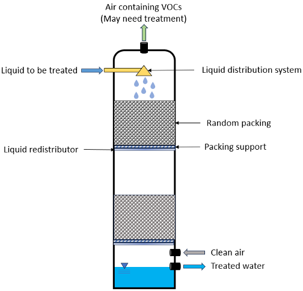

Air Stripping
=============

Air stripping uses towers packed with irregular shaped inert packing material
to transfer volatile constituents from the liquid to the vapor phase. 



    Figure 1. Air-stripping schematic.

This model uses the air-water equilibrium property package to determine the mass transfer properties
of a given liquid and air stream.

Given specifics about the tower packing, air and water flow rates, and the compond of interest,
the model will provide design and costing estimates.

OTO model

This Air Stripping model:
   * supports steady-state only
   * has a single user-specified target compound

.. TODO: Add index/reference to home page


Degrees of Freedom
------------------

With a properly configured property package, the air stripping model has 6 degrees of freedom
that require user input for the model to be fully specified.

For the unit model, the following variables are typically fixed.

.. csv-table::
   :header: "Variables", "Variable Name", "Symbol", "Unit"

   "Pressure drop gradient", "``pressure_drop_gradient``", ":math:`P_{drop}`", ":math:`\text{Pa }\text{m}^{-1}`"
   "Packing surface tension", "``packing_surf_tension``", ":math:`\sigma_{p}`", ":math:`\text{kg s}^{-2}`"
   "Packing nominal diameter", "``packing_diam_nominal``", ":math:`d_p`", ":math:`\text{m}`"
   "Packing total surface area", "``packing_surface_area_total``", ":math:`A_p`", ":math:`\text{m}^2`"
   "Packing factor", "``packing_factor``", ":math:`f`", ":math:`\text{m}^{-1}`"
   "Water surface tension", "``surf_tension_water``", ":math:`\sigma_{w}`", ":math:`\text{kg s}^{-2}`"

In addition to the state variables on the property model, the user must specify:

.. TODO: Add index/reference to AWE prop pkg docs

.. csv-table::
   :header: "Variables", "Variable Name", "Symbol", "Unit"

   "Liquid phase density", "``dens_mass_phase['Liq']``", ":math:`\rho_{liq}`", ":math:`\text{kg} \text{ m}^{-3}`"
   "Vapor phase density", "``dens_mass_phase['Vap']``", ":math:`\rho_{vap}`", ":math:`\text{kg} \text{ m}^{-3}`"
   "Liquid phase dynamic viscosity", "``visc_d_phase['Liq']``", ":math:`\mu_{liq}`", ":math:`\text{Pa s}`"
   "Vapor phase dynamic viscosity", "``visc_d_phase['Vap']``", ":math:`\mu_{vap}`", ":math:`\text{Pa s}`"


Model Structure
---------------

This air stripping model uses the ``ControlVolume0D`` to determine the mass-balance for the liquid and vapor streams.
There are two ports and each port has a liquid and vapor stream.

* Feed liquid stream (``inlet``)
* Feed air stream (``inlet``)
* Effluent liquid stream (``outlet``)
* Effluent air stream (``outlet``)

A critical user input to the model is the target compound, specfied via the ``target`` keyword 
in the unit model configuration. Removal of the target compound is determined by the mutable parameter
``target_reduction_frac`` that has a default value of 0.9 (i.e., 90% removal).

Sets
----


Model Components
----------------

The air stripping model includes many variables (``Var``), parameters (``Param``), and expressions (``Expression``).
These are provided in the following sections

Variables
+++++++++

.. csv-table::
    :header: "Description", "Variable Name", "Index", "Symbol", "Units"

    "Air blower power requirement", "``blower_power``", "None", ":math:`p_{blow}`", ":math:`\text{kW}`"
    "Water pump power requirement", "``pump_power``", "None", ":math:`p_{pump}`", ":math:`\text{kW}`"
    "Total specific surface area of packing", "``packing_surface_area_total``", "None", ":math:`a_t`", ":math:`\text{m}^{-1}`"
    "Wetted specific surface area of packing", "``packing_surface_area_wetted``", "None", ":math:`a_s`", ":math:`\text{m}^{-1}`"
    "Nominal diameter of packing material", "``packing_diam_nominal``", "None", ":math:`d_p`", ":math:`\text{m}`"
    "Packing factor", "``packing_factor``", "None", ":math:`f`", ":math:`\text{dimensionless}`"
    "Surface tension of packing", "``packing_surf_tension``", "None", ":math:`\sigma_p`", ":math:`\text{kg s}^{-2}`"
    "Surface tension of water", "``surf_tension_water``", "None", ":math:`\sigma_w`", ":math:`\text{kg s}^{-2}`"
    "Stripping factor", "``stripping_factor``", "``[target]``", ":math:`S`", ":math:`\text{dimensionless}`"
    "Minimum air-to-water ratio", "``air_water_ratio_min``", "None", ":math:`q_{min}`", ":math:`\text{dimensionless}`"
    "Packing height", "``packing_height``", "None", ":math:`Z`", ":math:`\text{m}`"
    "Vapor and liquid mass loading rate in tower", "``mass_loading_rate``", "``[p]``", ":math:`G_m, L_m`", ":math:`\text{kg } \text{s m}^{-2}`"
    "Height of one transfer unit", "``height_transfer_unit``", "``[target]``", ":math:`\text{HTU}`", ":math:`\text{m}`"
    "Number of transfer units", "``number_transfer_unit``", "``[target]``", ":math:`\text{NTU}`", ":math:`\text{dimensionless}`"
    "Pressure drop per length of packed bed", "``pressure_drop_gradient``", "None", ":math:`P_{drop}`", ":math:`\text{Pa m}^{-1}`"
    "Overall mass transfer coefficient", "``overall_mass_transfer_coeff``", "``[target]``", ":math:`K_La`", ":math:`\text{m s}^{-1}`"
    "OTO model: E parameter", "``oto_E``", "None", ":math:`E`", ":math:`\text{dimensionless}`"
    "OTO model: F parameter", "``oto_F``", "None", ":math:`F`", ":math:`\text{dimensionless}`"
    "OTO model: Pressure drop a0 term", "``oto_a0``", "None", ":math:`A_0`", ":math:`\text{dimensionless}`"
    "OTO model: Pressure drop a1 term", "``oto_a1``", "None", ":math:`A_1`", ":math:`\text{dimensionless}`"
    "OTO model: Pressure drop a2 term", "``oto_a2``", "None", ":math:`A_2`", ":math:`\text{dimensionless}`"
    "OTO model: M parameter", "``oto_M``", "None", ":math:`M`", ":math:`\text{dimensionless}`"
    "OTO model: phase mass transfer coefficient in tower", "``oto_mass_transfer_coeff``", "``phase_target_set``", ":math:`k_{liq}, k_{vap}`", ":math:`\text{m s}^{-1}`"
    .. "", "````", "", ":math:`\text{}`", ":math:`\text{}`"

Parameters
++++++++++

All parameters related to OTO model are *not* mutable.

.. csv-table::
    :header: "Description", "Default Value", "Parameter Name", "Index", "Symbol", "Units"

    "Safety factor for tower height", ":math:`\text{1.2}`", "``tower_height_safety_factor``", "None", ":math:`f_z`", ":math:`\text{dimensionless}`"
    "Diameter of tower access ports", ":math:`\text{6}`", "``tower_port_diameter``", "None", ":math:`d_{port}`", ":math:`\text{inch}`"
    "Diaeter of tower inlet and outlet piping", ":math:`\text{6}`", "``tower_pipe_diameter``", "None", ":math:`d_{pipe}`", ":math:`\text{inch}`"
    "Fractional reduction of taret component", ":math:`\text{0.9}`", "``target_reduction_frac``", "``[target]``", ":math:`X`", ":math:`\text{dimensionless}`"
    "Safety factor for overall mass transfer coefficient", ":math:`\text{0.7}`", "``overall_mass_transfer_coeff_sf``", "None", ":math:`f_{KLa}`", ":math:`\text{dimensionless}`"
    "Blower efficiency", ":math:`\text{0.4}`", "``blower_efficiency``", "None", ":math:`\eta_{blow}`", ":math:`\text{dimensionless}`"
    "Pump efficiency", ":math:`\text{0.85}`", "``pump_efficiency``", "None", ":math:`\eta_{pump}`", ":math:`\text{dimensionless}`"
    "OTO model: Pressure drop a0 term, first parameter", ":math:`\text{-6.6599}`", "``oto_a0_param1``", "None", ":math:`\alpha_{0,1}`", ":math:`\text{dimensionless}`"
    "OTO model: Pressure drop a0 term, second parameter", ":math:`\text{4.3077}`", "``oto_a0_param2``", "None", ":math:`\alpha_{0,2}`", ":math:`\text{dimensionless}`"
    "OTO model: Pressure drop a0 term, third parameter", ":math:`\text{-1.3503}`", "``oto_a0_param3``", "None", ":math:`\alpha_{0,3}`", ":math:`\text{dimensionless}`"
    "OTO model: Pressure drop a0 term, fourth parameter", ":math:`\text{0.15931}`", "``oto_a0_param4``", "None", ":math:`\alpha_{0,4}`", ":math:`\text{dimensionless}`"
    "OTO model: Pressure drop a1 term, first parameter", ":math:`\text{3.0945}`", "``oto_a1_param1``", "None", ":math:`\alpha_{1,1}`", ":math:`\text{dimensionless}`"
    "OTO model: Pressure drop a1 term, second parameter", ":math:`\text{-4.3512}`", "``oto_a1_param2``", "None", ":math:`\alpha_{1,2}`", ":math:`\text{dimensionless}`"
    "OTO model: Pressure drop a1 term, third parameter", ":math:`\text{1.6240}`", "``oto_a1_param3``", "None", ":math:`\alpha_{1,3}`", ":math:`\text{dimensionless}`"
    "OTO model: Pressure drop a1 term, fourth parameter", ":math:`\text{-0.20855}`", "``oto_a1_param4``", "None", ":math:`\alpha_{1,4}`", ":math:`\text{dimensionless}`"
    "OTO model: Pressure drop a2 term, first parameter", ":math:`\text{1.7611}`", "``oto_a2_param1``", "None", ":math:`\alpha_{2,1}`", ":math:`\text{dimensionless}`"
    "OTO model: Pressure drop a2 term, second parameter", ":math:`\text{-2.3394}`", "``oto_a2_param2``", "None", ":math:`\alpha_{2,2}`", ":math:`\text{dimensionless}`"
    "OTO model: Pressure drop a2 term, third parameter", ":math:`\text{0.89914}`", "``oto_a2_param3``", "None", ":math:`\alpha_{2,3}`", ":math:`\text{dimensionless}`"
    "OTO model: Pressure drop a2 term, fourth parameter", ":math:`\text{-0.115971}`", "``oto_a2_param4``", "None", ":math:`\alpha_{2,4}`", ":math:`\text{dimensionless}`"
    "OTO wetted surface area of packing correlation parameter", ":math:`\text{-1.45}`", "``oto_aw_param``", "None", ":math:`\omega_0`", ":math:`\text{dimensionless}`"
    "OTO wetted surface area of packing correlation - exponent 1", ":math:`\text{0.75}`", "``oto_aw_exp1``", "None", ":math:`\omega_1`", ":math:`\text{dimensionless}`"
    "OTO wetted surface area of packing correlation - exponent 2", ":math:`\text{0.1}`", "``oto_aw_exp2``", "None", ":math:`\omega_2`", ":math:`\text{dimensionless}`"
    "OTO wetted surface area of packing correlation - exponent 3", ":math:`\text{-0.05}`", "``oto_aw_exp3``", "None", ":math:`\omega_3`", ":math:`\text{dimensionless}`"
    "OTO wetted surface area of packing correlation - exponent 4", ":math:`\text{0.2}`", "``oto_aw_exp4``", "None", ":math:`\omega_4`", ":math:`\text{dimensionless}`"
    "OTO liquid mass transfer correlation parameter", ":math:`\text{0.0051}`", "``oto_liq_mass_xfr_param``", "None", ":math:`\varepsilon_0`", ":math:`\text{m s}^{-1}`"
    "OTO liquid mass transfer correlation Re exponent", ":math:`\frac{2}{3}`", "``oto_liq_mass_xfr_exp1``", "None", ":math:`\varepsilon_1`", ":math:`\text{dimensionless}`"
    "OTO liquid mass transfer correlation Sc exponent", ":math:`\text{-0.5}`", "``oto_liq_mass_xfr_exp2``", "None", ":math:`\varepsilon_2`", ":math:`\text{dimensionless}`"
    "OTO liquid mass transfer correlation Ef exponent", ":math:`\text{0.4}`", "``oto_liq_mass_xfr_exp3``", "None", ":math:`\varepsilon_3`", ":math:`\text{dimensionless}`"
    "OTO liquid mass transfer correlation Sh exponent", ":math:`-\frac{1}{3}`", "``oto_liq_mass_xfr_exp4``", "None", ":math:`\varepsilon_4`", ":math:`\text{dimensionless}`"
    "OTO gas mass transfer correlation parameter", ":math:`\text{5.23}`", "``oto_gas_mass_xfr_param``", "None", ":math:`\kappa_0`", ":math:`\text{dimensionless}`"
    "OTO gas mass transfer correlation Re exponent", ":math:`\text{0.7}`", "``oto_gas_mass_xfr_exp1``", "None", ":math:`\kappa_1`", ":math:`\text{dimensionless}`"
    "OTO gas mass transfer correlation Sc exponent", ":math:`\frac{1}{3}`", "``oto_gas_mass_xfr_exp2``", "None", ":math:`\kappa_2`", ":math:`\text{dimensionless}`"
    "OTO gas mass transfer correlation Er exponent", ":math:`\text{-2}`", "``oto_gas_mass_xfr_exp3``", "None", ":math:`\kappa_3`", ":math:`\text{dimensionless}`"


Equations
---------


References
----------
