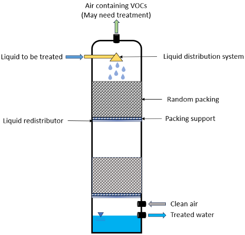

Air Stripping
=============

Air stripping uses towers packed with irregular shaped inert packing material
to transfer volatile constituents from the liquid to the vapor phase.
This air stripping model:
* supports steady-state only
* supports a single liquid phase only
* has a single user-specified target compound
* assumes isothermal and isobaric conditions

Figure 1. Air-stripping schematic.

This model uses the air-water equilibrium property package to determine the mass transfer properties
of a given liquid and air stream. Given specifics about the tower packing, air and water flow rates, and the compond of interest,
the model will provide design and costing estimates.
The model relies on correlations and parameters from Onda, K., Takeuchi, H., & Okumoto, Y. (1968) and is referred 
to as the "OTO model" in this documentation and in names of variables and parameters in the model.

.. TODO: Add index/reference to home page

Degrees of Freedom
------------------

With a properly configured property package, the air stripping model has 6 degrees of freedom
that require user input for the model to be fully specified.

For the unit model, the following variables are typically fixed.

.. csv-table::
   :header: "Variables", "Variable Name", "Symbol", "Unit"

   "Pressure drop gradient", "``pressure_drop_gradient``", ":math:`\cfrac{\Delta P_{pack}}{Z_{pack}}`", ":math:`\text{Pa }\text{m}^{-1}`"
   "Packing surface tension", "``packing_surf_tension``", ":math:`\sigma_{p}`", ":math:`\text{kg s}^{-2}`"
   "Packing nominal diameter", "``packing_diam_nominal``", ":math:`d_p`", ":math:`\text{m}`"
   "Packing total surface area", "``packing_surface_area_total``", ":math:`A_p`", ":math:`\text{m}^2`"
   "Packing factor", "``packing_factor``", ":math:`f_{pack}`", ":math:`\text{m}^{-1}`"
   "Water surface tension", "``surf_tension_water``", ":math:`\sigma_{w}`", ":math:`\text{kg s}^{-2}`"

In addition to the state variables on the property model, the user must specify:

.. TODO: Add index/reference to AWE prop pkg docs

.. csv-table::
   :header: "Variables", "Variable Name", "Symbol", "Unit"

   "Liquid phase density", "``dens_mass_phase['Liq']``", ":math:`\rho_l`", ":math:`\text{kg} \text{ m}^{-3}`"
   "Vapor phase density", "``dens_mass_phase['Vap']``", ":math:`\rho_g`", ":math:`\text{kg} \text{ m}^{-3}`"
   "Liquid phase dynamic viscosity", "``visc_d_phase['Liq']``", ":math:`\mu_{liq}`", ":math:`\text{Pa s}`"
   "Vapor phase dynamic viscosity", "``visc_d_phase['Vap']``", ":math:`\mu_{vap}`", ":math:`\text{Pa s}`"

Model Structure
---------------

This air stripping model uses the ``ControlVolume0D`` to determine the mass-balance for the liquid and vapor streams.
There are two ports and each port has a liquid and vapor stream.

* Feed liquid stream (``inlet``)
* Feed air stream (``inlet``)
* Effluent liquid stream (``outlet``)
* Effluent air stream (``outlet``)

A critical user input to the model is the target compound, specfied via the ``target`` keyword 
in the unit model configuration. Removal of the target compound is determined by the mutable parameter
``target_reduction_frac`` that has a default value of 0.9 (i.e., 90% removal).

Sets
----

In addition to the Sets from the air-water equilibrium property package, the model contains three additional Sets for the target component in different phases:

.. csv-table::
    :header: "Description", "Set Name", "Symbol", "Indices"

    "Target compound with no phase", "``target_set``", "``[j]``", "Target compound from model configuration"
    "Target compound in liquid phase", "``liq_target_set``", "``[p, j]``", "Liquid phase and target compound from model configuration"
    "Target compound in liquid and vapor phase", "``phase_target_set``", "``[p, j]``", "Liquid and vapor phase and target compound from model configuration"

Model Components
----------------

The air stripping model includes many variables (``Var``) and parameters (``Param``).
These are provided in the following sections.

Variables
+++++++++

.. csv-table::
    :header: "Description", "Variable Name", "Index", "Symbol", "Units"

    "Pressure drop per length of packed bed", "``pressure_drop_gradient``", "None", ":math:`\cfrac{\Delta P_{pack}}{Z_{pack}}`", ":math:`\text{Pa m}^{-1}`"
    "Overall mass transfer coefficient", "``overall_mass_transfer_coeff``", "``[target]``", ":math:`K_La`", ":math:`\text{m s}^{-1}`"
    "Packing height", "``packing_height``", "None", ":math:`Z_{pack}`", ":math:`\text{m}`"
    "Stripping factor", "``stripping_factor``", "``[target]``", ":math:`S`", ":math:`\text{dimensionless}`"
    "Total specific surface area of packing", "``packing_surface_area_total``", "None", ":math:`a_t`", ":math:`\text{m}^{-1}`"
    "Wetted specific surface area of packing", "``packing_surface_area_wetted``", "None", ":math:`a_w`", ":math:`\text{m}^{-1}`"
    "Nominal diameter of packing material", "``packing_diam_nominal``", "None", ":math:`d_p`", ":math:`\text{m}`"
    "Packing factor", "``packing_factor``", "None", ":math:`f`", ":math:`\text{dimensionless}`"
    "Surface tension of packing", "``packing_surf_tension``", "None", ":math:`\sigma_p`", ":math:`\text{kg s}^{-2}`"
    "Surface tension of water", "``surf_tension_water``", "None", ":math:`\sigma_w`", ":math:`\text{kg s}^{-2}`"
    "Minimum air-to-water ratio", "``air_water_ratio_min``", "None", ":math:`\bigg( \cfrac{Q_{air}}{Q_{water}} \bigg)_{min}`", ":math:`\text{dimensionless}`"
    "Vapor and liquid mass loading rate in tower", "``mass_loading_rate``", "``[p]``", ":math:`G_m, L_m`", ":math:`\text{kg } \text{s m}^{-2}`"
    "Height of one transfer unit", "``height_transfer_unit``", "``[target]``", ":math:`\text{HTU}`", ":math:`\text{m}`"
    "Number of transfer units", "``number_transfer_unit``", "``[target]``", ":math:`\text{NTU}`", ":math:`\text{dimensionless}`"
    "Air blower power requirement", "``blower_power``", "None", ":math:`p_{blow}`", ":math:`\text{kW}`"
    "Water pump power requirement", "``pump_power``", "None", ":math:`p_{pump}`", ":math:`\text{kW}`"
    "OTO model: E parameter", "``oto_E``", "None", ":math:`E_{oto}`", ":math:`\text{dimensionless}`"
    "OTO model: F parameter", "``oto_F``", "None", ":math:`F_{oto}`", ":math:`\text{dimensionless}`"
    "OTO model: Pressure drop a0 term", "``oto_a0``", "None", ":math:`A_0`", ":math:`\text{dimensionless}`"
    "OTO model: Pressure drop a1 term", "``oto_a1``", "None", ":math:`A_1`", ":math:`\text{dimensionless}`"
    "OTO model: Pressure drop a2 term", "``oto_a2``", "None", ":math:`A_2`", ":math:`\text{dimensionless}`"
    "OTO model: M parameter", "``oto_M``", "None", ":math:`M_{oto}`", ":math:`\text{dimensionless}`"
    "OTO model: phase mass transfer coefficient in tower", "``oto_mass_transfer_coeff``", "``phase_target_set``", ":math:`k_l, k_g`", ":math:`\text{m s}^{-1}`"

Parameters
++++++++++

All parameters related to OTO model are *not* mutable.

.. csv-table::
    :header: "Description", "Default Value", "Parameter Name", "Index", "Symbol", "Units"

    "Fractional reduction of target component", ":math:`\text{0.9}`", "``target_reduction_frac``", "``[target]``", ":math:`X`", ":math:`\text{dimensionless}`"
    "Factor to calculate tower height", ":math:`\text{1.2}`", "``tower_height_factor``", "None", ":math:`f_z`", ":math:`\text{dimensionless}`"
    "Safety factor for overall mass transfer coefficient", ":math:`\text{0.7}`", "``overall_mass_transfer_coeff_sf``", "None", ":math:`f_{KLa}`", ":math:`\text{dimensionless}`"
    "Pressure drop parameter for mister, support, ducting, inlet/outlet", ":math:`275`", "``pressure_drop_tower_param``", "None", ":math:`f_{pt}`", ":math:`\text{N s}^2 \text{ m}^{-4}`"
    "Diameter of tower access ports", ":math:`\text{6}`", "``tower_port_diameter``", "None", ":math:`d_{port}`", ":math:`\text{inch}`"
    "Diameter of tower inlet and outlet piping", ":math:`\text{6}`", "``tower_pipe_diameter``", "None", ":math:`d_{pipe}`", ":math:`\text{inch}`"
    "Blower efficiency", ":math:`\text{0.4}`", "``blower_efficiency``", "None", ":math:`\eta_{blow}`", ":math:`\text{dimensionless}`"
    "Pump efficiency", ":math:`\text{0.85}`", "``pump_efficiency``", "None", ":math:`\eta_{pump}`", ":math:`\text{dimensionless}`"
    "OTO model: Pressure drop a0 term, first parameter", ":math:`\text{-6.6599}`", "``oto_a0_param1``", "None", ":math:`\alpha_{0,0}`", ":math:`\text{dimensionless}`"
    "OTO model: Pressure drop a0 term, second parameter", ":math:`\text{4.3077}`", "``oto_a0_param2``", "None", ":math:`\alpha_{0,1}`", ":math:`\text{dimensionless}`"
    "OTO model: Pressure drop a0 term, third parameter", ":math:`\text{-1.3503}`", "``oto_a0_param3``", "None", ":math:`\alpha_{0,2}`", ":math:`\text{dimensionless}`"
    "OTO model: Pressure drop a0 term, fourth parameter", ":math:`\text{0.15931}`", "``oto_a0_param4``", "None", ":math:`\alpha_{0,3}`", ":math:`\text{dimensionless}`"
    "OTO model: Pressure drop a1 term, first parameter", ":math:`\text{3.0945}`", "``oto_a1_param1``", "None", ":math:`\alpha_{1,0}`", ":math:`\text{dimensionless}`"
    "OTO model: Pressure drop a1 term, second parameter", ":math:`\text{-4.3512}`", "``oto_a1_param2``", "None", ":math:`\alpha_{1,1}`", ":math:`\text{dimensionless}`"
    "OTO model: Pressure drop a1 term, third parameter", ":math:`\text{1.6240}`", "``oto_a1_param3``", "None", ":math:`\alpha_{1,2}`", ":math:`\text{dimensionless}`"
    "OTO model: Pressure drop a1 term, fourth parameter", ":math:`\text{-0.20855}`", "``oto_a1_param4``", "None", ":math:`\alpha_{1,3}`", ":math:`\text{dimensionless}`"
    "OTO model: Pressure drop a2 term, first parameter", ":math:`\text{1.7611}`", "``oto_a2_param1``", "None", ":math:`\alpha_{2,0}`", ":math:`\text{dimensionless}`"
    "OTO model: Pressure drop a2 term, second parameter", ":math:`\text{-2.3394}`", "``oto_a2_param2``", "None", ":math:`\alpha_{2,1}`", ":math:`\text{dimensionless}`"
    "OTO model: Pressure drop a2 term, third parameter", ":math:`\text{0.89914}`", "``oto_a2_param3``", "None", ":math:`\alpha_{2,2}`", ":math:`\text{dimensionless}`"
    "OTO model: Pressure drop a2 term, fourth parameter", ":math:`\text{-0.115971}`", "``oto_a2_param4``", "None", ":math:`\alpha_{2,3}`", ":math:`\text{dimensionless}`"
    "OTO wetted surface area of packing correlation parameter", ":math:`\text{-1.45}`", "``oto_aw_param``", "None", ":math:`\omega_0`", ":math:`\text{dimensionless}`"
    "OTO wetted surface area of packing correlation - exponent 1", ":math:`\text{0.75}`", "``oto_aw_exp1``", "None", ":math:`\omega_1`", ":math:`\text{dimensionless}`"
    "OTO wetted surface area of packing correlation - exponent 2", ":math:`\text{0.1}`", "``oto_aw_exp2``", "None", ":math:`\omega_2`", ":math:`\text{dimensionless}`"
    "OTO wetted surface area of packing correlation - exponent 3", ":math:`\text{-0.05}`", "``oto_aw_exp3``", "None", ":math:`\omega_3`", ":math:`\text{dimensionless}`"
    "OTO wetted surface area of packing correlation - exponent 4", ":math:`\text{0.2}`", "``oto_aw_exp4``", "None", ":math:`\omega_4`", ":math:`\text{dimensionless}`"
    "OTO liquid mass transfer correlation parameter", ":math:`\text{0.0051}`", "``oto_liq_mass_xfr_param``", "None", ":math:`\varepsilon_0`", ":math:`\text{m s}^{-1}`"
    "OTO liquid mass transfer correlation :math:`\text{Re}` exponent", ":math:`\frac{2}{3}`", "``oto_liq_mass_xfr_exp1``", "None", ":math:`\varepsilon_1`", ":math:`\text{dimensionless}`"
    "OTO liquid mass transfer correlation :math:`\text{Sc}` exponent", ":math:`\text{-0.5}`", "``oto_liq_mass_xfr_exp2``", "None", ":math:`\varepsilon_2`", ":math:`\text{dimensionless}`"
    "OTO liquid mass transfer correlation :math:`f_{eff}` exponent", ":math:`\text{0.4}`", "``oto_liq_mass_xfr_exp3``", "None", ":math:`\varepsilon_3`", ":math:`\text{dimensionless}`"
    "OTO liquid mass transfer correlation fourth exponent", ":math:`-\frac{1}{3}`", "``oto_liq_mass_xfr_exp4``", "None", ":math:`\varepsilon_4`", ":math:`\text{dimensionless}`"
    "OTO gas mass transfer correlation parameter", ":math:`\text{5.23}`", "``oto_gas_mass_xfr_param``", "None", ":math:`\kappa_0`", ":math:`\text{dimensionless}`"
    "OTO gas mass transfer correlation :math:`\text{Re}` exponent", ":math:`\text{0.7}`", "``oto_gas_mass_xfr_exp1``", "None", ":math:`\kappa_1`", ":math:`\text{dimensionless}`"
    "OTO gas mass transfer correlation :math:`\text{Sc}` exponent", ":math:`\frac{1}{3}`", "``oto_gas_mass_xfr_exp2``", "None", ":math:`\kappa_2`", ":math:`\text{dimensionless}`"
    "OTO gas mass transfer correlation :math:`f_{eff}` exponent", ":math:`\text{-2}`", "``oto_gas_mass_xfr_exp3``", "None", ":math:`\kappa_3`", ":math:`\text{dimensionless}`"

Equations and Relationships
---------------------------

Unit Model
++++++++++

.. csv-table::
    :header: "Description", "Equation"

    "Schmidt number", ":math:`Sc_{p} = \cfrac{\mu_p}{\rho_p D_p}`"
    "Reynolds number", ":math:`Re = \cfrac{L_m}{a_t \mu_l}`"
    "Froude number", ":math:`Fr = \cfrac{L_m^2 a_t}{\rho_l g}`"
    "Weber number", ":math:`We = \cfrac{L_m^2}{\rho_l a_t \sigma_w}`"
    "Packing efficiency number", ":math:`f_{eff} = a_td_p`"
    "Cross sectional area of tower", ":math:`A_{tower} = \cfrac{M_{liq}}{L_m}`"
    "Diameter of tower", ":math:`d_{tower} = \sqrt{\cfrac{4 A_{tower}}{\pi}}`"
    "Height of tower", ":math:`Z_{tower} = Z_{pack} f_z`"
    "Volume of tower", ":math:`V_{tower} = A_{tower} Z_{tower}`"
    "Volume of packing", ":math:`V_{pack} = A_{tower} Z_{pack}`"
    "Stripping factor", ":math:`S_j = h_j \bigg( \cfrac{Q_{air}}{Q_{water}} \bigg)_{op}`"
    "Minimum air-to-water ratio", ":math:`\bigg( \cfrac{Q_{air}}{Q_{water}} \bigg)_{min} = \cfrac{c_{0,j} - c_{0,j} (1 - X_j)}{c_{0,j} h_j}`"
    "Overall mass transfer coefficient", ":math:`K_La = \Bigg( \cfrac{1}{k_la_w}+\cfrac{1}{h_j k_ga_w} \Bigg)f_{KLa}`"
    "Height of transfer unit", ":math:`HTU = \cfrac{Q_l}{A_{tower}K_La}`"
    "Number of transfer units", ":math:`NTU =  \text{ln}\Bigg( \cfrac{1 + \frac{c_{0,j}}{c_{0,j} (1 - X_j)}(S-1)}{S} \Bigg)\Bigg( \cfrac{S}{S - 1} \Bigg)`"
    "Packing height", ":math:`Z_{pack} = (HTU)(NTU)`"
    "Pressure drop through tower", ":math:`\Delta P_{tower} = f_{pt} \bigg( \cfrac{Q_{air}}{A_{tower}} \bigg)^2`"
    "Overall pressure drop across unit", ":math:`\Delta P = \cfrac{\Delta P_{pack}}{Z_{pack}} Z_{pack}f_z + \Delta P_{tower}`"
    "Liquid-phase mass loading rate", ":math:`L_m = \cfrac{G_m M_{liq}}{M_{vap}}`"
    "Vapor-phase mass loading rate", ":math:`G_m = \sqrt{\cfrac{M_{oto} \rho_g (\rho_l - \rho_g)}{f_{pack} \mu_l^{0.1}}}`"

The equations used to determine several variables needed come from the OTO model, a common set of mass transfer correlations for modeling air stripping processes
including the liquid- and gas-phase mass transfer coefficients.
These relationships are summarized in the following table.

.. csv-table::
    :header: "Description", "Equation"

    "Wetted surface area of packing material", ":math:`a_w = a_t \Bigg[1 - \text{exp} \bigg( \omega_0 \bigg( \cfrac{\sigma_c}{\sigma_w}\bigg)^{\omega_1}  \bigg( \cfrac{L_m}{a_t \mu_{liq}} \bigg)^{\omega_2} \bigg( \cfrac{L_m^2 a_t}{\rho_l^2 g} \bigg)^{\omega_3} \bigg( \cfrac{L_m^2}{\rho_l a_t \sigma_w} \bigg)^{\omega_4}    \bigg)   \Bigg]`"
    "Liquid-phase mass transfer coefficient", ":math:`k_l = \varepsilon_0 \bigg( \cfrac{L_m}{a_w \mu_l} \bigg)^{\varepsilon_1} \text{Sc}_{liq,j}^{\varepsilon_2} f_{eff}^{\varepsilon_3} \bigg( \cfrac{\rho_l}{\mu_l g} \bigg)^{\varepsilon_4}`"
    "Gas-phase mass transfer coefficient", ":math:`k_g = \kappa_0 (a_t D_{g,j}) \text{Re}^{\kappa_1} \text{Sc}_{g,j}^{\kappa_2} f_{eff}^{\kappa_3}`"
    "OTO Model: F parameter", ":math:`F = \text{log}_{10}\bigg( \cfrac{\Delta P_{pack}}{Z_{pack}} \bigg)`"
    "OTO Model: A0 parameter", ":math:`A_0 = \alpha_{0,0} + \alpha_{0,1}F+ \alpha_{0,2}F^2+ \alpha_{0,3}F^3`"
    "OTO Model: A1 parameter", ":math:`A_1 = \alpha_{1,0} + \alpha_{1,1}F+ \alpha_{1,2}F^2+ \alpha_{1,3}F^3`"
    "OTO Model: A2 parameter", ":math:`A_2 = \alpha_{2,0} + \alpha_{2,1}F+ \alpha_{2,2}F^2+ \alpha_{2,3}F^3`"
    "OTO Model: M parameter", ":math:`\text{log}_{10}M_{oto} = A_0 + A_1(E) + A_2(E)^2`"
    "OTO Model: E parameter", ":math:`E = -\text{log}_{10}\Bigg[ \Big( \cfrac{Q_{air}}{Q_{water}} \Big)_{op} \sqrt{\cfrac{\rho_g}{\rho_l} -\Big( \cfrac{\rho_g}{\rho_l} \Big)^2} \Bigg]`"

Costing
+++++++

Capital costs for air stripping in the costing package are the summation of costs for 
the tower, packing, ports, piping, internals (distributor and plate support), mist eliminator, pump, and blower.

Packing is costed based based on the packing volume, where :math:`c_{pack}` is the cost of packing per cubic meter:

.. math::
    C_{pack} = V_{pack} c_{pack}

The cost of the tower shell is a function of the tower diameter in inches and the height of the tower:

.. math::
    C_{tower} = Z_{tower} \big( 45.2 + 3.5 d_{tower} - 7.7 \times 10^{-3} d_{tower} \big)

Tower access port costs are a function of the ports diameter in inches:

.. math::
    C_{port} = -31.6 + 72.8 d_{port} -2.8 d_{port}^2 + 0.11 d_{port}^3

Inlet and outlet ports for the water flow are a function of the piping diameter in inches. The cost for each is:

.. math::
    C_{io,w} = 2 \big( 133.8 + 42 d_{pipe} + 4.8 d_{pipe}^2 \big)

Inlet and outlet ports for air flow are assumed to be 5% greater than for water:

.. math::
    C_{io,a} = 1.05 C_{io,w} 

The tray rings used to support the distributor and packing plates. They are costed as a function of the tower diameter in inches:

.. math::
    C_{ring} = 70.4 + 4.45 d_{tower} + 1.73 \times 10^{-2} d_{tower}^2

The cost of the distributor and packing plates themselves are also a function of the tower diameter in inches:

.. math::
    C_{distr} = 658.1 - 6.5d_{tower} + 0.22 d_{tower}^2

.. math:: 
    C_{plate} = 20.6 + 1.1 d_{tower} + 9.7 \times 10^{-2} d_{tower}^2

Capital cost of the mist eliminator is a function of the tower diameter in inches:

.. math::
    C_{mist} = 46.4 + 9.3 d_{tower} + 0.14 d_{tower}^2

The cost of the water pump is related to the pumping power required:

.. math::
    C_{pump} = 9.84 \times 10^3 \bigg( \cfrac{p_{pump}}{4} \bigg)^{0.55}

And capital cost for the blower is a function of the air flow rate required in cubic meters per hour:

.. math::
    C_{blow} = \text{4,450} + 57 \bigg( Q_{air} \bigg)^{0.8}

The total capital cost for the air stripper is:

.. math::
    C_{tot} = C_{pack} + C_{tower} + C_{port} + C_{io,w} + C_{io,a} + C_{ring} + C_{distr} + C_{plate} + C_{mist} + C_{pump} + C_{blow}

Operational costs are the energy required for the pump and blower.

The blower brake power required is a function of the required air mass flow rate and the inlet pressure necessary. 
The inlet pressure is calculated from the pressure drop through the demister, packing support, duct work, and inlet/outlet:

.. math::
    \Delta P_{tower} = \Bigg( \cfrac{Q_{air}}{A_{tower}} \Bigg)^2 f_{pt} 

Thus, the required inlet pressure is:

.. math::
    P_{in} = P_{amb} + \Delta P_{pack} + \Delta P_{tower}

And the blower brake power is:

.. math::
    p_{blow} = \Bigg( \cfrac{M_{air} R T_{air}}{m_{N,air} (0.283) \eta_{blow}}\Bigg) \Bigg( \bigg (\cfrac{P_{in}}{P_{amb}}\bigg)^{0.283} - 1 \Bigg)

Where :math:`M_{air}` is the mass flow rate of air, :math:`R` is the universal gas constant, :math:`m_{N,air}` is the molar mass of air, and :math:`P_{amb}` is the ambient pressure.

The water pumping power required is:

.. math::
    p_{pump} = \cfrac{M_{water} Z_{tower} g}{\eta_{pump}}

Where :math:`M_{water}` is the mass flow rate of water and :math:`g` is the gravitational constant.
The total power required for the air stripping unit is:

.. math::
    p_{tot} = p_{blow} + p_{pump}

References
----------

**Unit model**

| [1] Onda, K., Takeuchi, H., & Okumoto, Y. (1968). 
| Mass Transfer Coefficients between Gas and Liquid Phases in Packed Columns. 
| *Journal of Chemical Engineering of Japan*, 1(1), 56-62. doi:10.1252/jcej.1.56

| [2] Crittenden, J. C., Trussell, R. R., Hand, D. W., Howe, K. J., & Tchobanoglous, G. (2012). 
| Chap. 7 & 14 in MWH's Water Treatment: Principles and Design (3rd ed.). doi:10.1002/9781118131473

| [3] Edzvald, J. (2011). Chapter 6: Gas-Liquid Processes: Principles and Applications. 
| Water Quality & Treatment: A Handbook on Drinking Water (6 ed.): American Water Works Association.
| ISBN 9780071630115

**Costing model**

| [4] Dzombak, D. A., Roy, S. B., & Fang, H.-J. (1993).
| Air-Stripper Design and Costing Computer Program
| *Journal AWWA*, 85(10), 63-72. doi.org/10.1002/j.1551-8833.1993.tb06080.x

| [5] Dzombak, D., Sherif, M., Shah, N., Vaidyanathan, V., Fang, H. J., & Roy, S. (2021).
| ASDC for Windows: Air Stripper Design and Costing.
| https://kilthub.cmu.edu/articles/software/ASDC_for_Windows_Air_Stripper_Design_and_Costing/14474007

| [6] Towler, G., & Sinnott, R. (2013). Chapter 7 - Capital Cost Estimating.
| Chemical Engineering Design (Second Edition) (pp. 307-354).
| Butterworth-Heinemann. https://doi.org/https://doi.org/10.1016/B978-0-08-096659-5.00007-9

| [7] Smith, R. (2005). 
| Chemical Process Design and Integration. John Wiley & Sons Ltd (2005).
| ISBN 9780471486800