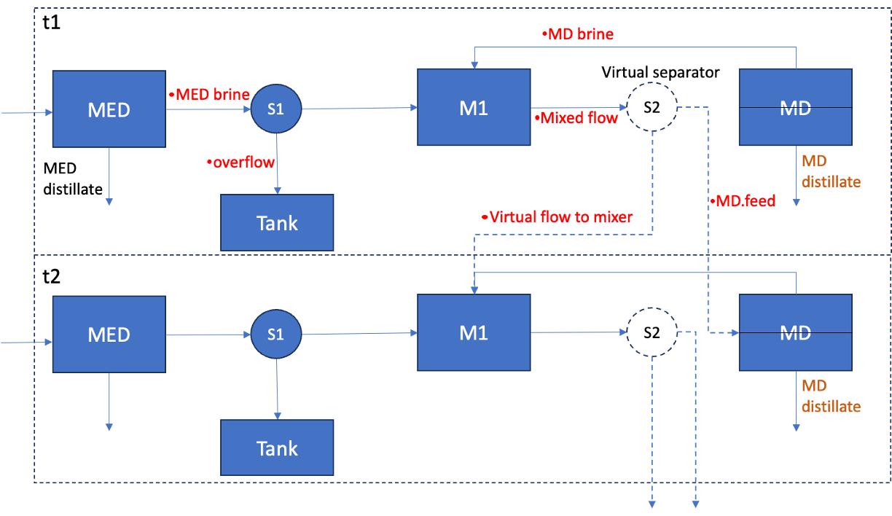
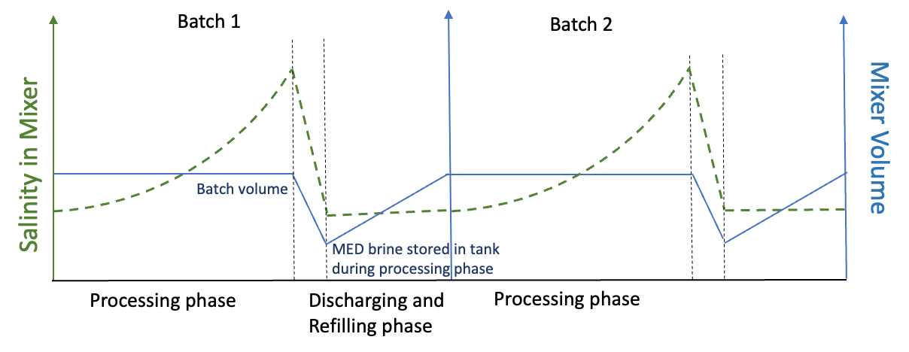

Low Temperature Multi-effect Distillation - Semibatch, Vacuum Air-gap Membrane Distillation (LTMED - VAGMD) Flowsheet
===================================================================================================================

Implementation
--------------

This flowsheet simulates the semibatch operation of an LTMED - VAGMD system using IDAES' multiperiod framework, and
   * each period in the processing phase contains a steady-state flowsheet as depicted in Fig. 1   
   * each flowsheet incorporates a list of the following models
  
      * one :any:`LT_MED_homepage` model from WaterTAP-REFLO
      * one :any:`VAGMD_base_homepage` from WaterTAP-REFLO, 
      * one `Mixer <https://idaes-pse.readthedocs.io/en/2.4.0/reference_guides/model_libraries/generic/unit_models/mixer.html>`_ model from IDAES
      * two `Separator <https://idaes-pse.readthedocs.io/en/2.4.0/reference_guides/model_libraries/generic/unit_models/separator.html>`_ models from IDAES
   * the system performance is evaluated based on a single Aquastill MD module which all inputs are associated with
   * the system can be scaled to any capacity in the cost evaluation

    Figure 1. Diagram of a MED-VAGMD semibatch system - processing phase.

This configuration takes feed water into the MED system first, and treats the MED brine with VAGMD in a 
semibatch operation, to reach a higher water recovery rate and thermal efficiency. In each period, mixer M1
receives brine from both MED and VAGMD components and updates the properties of the mixed liquid for the next 
period, which will be the feed to the VAGMD component. Separator S1 diverges the MED brine, so that the 
liquid volume in the mixer remains the same between periods, while the excess brine will be stored in a tank
during a single batch and discharged to the mixer in the next batch. Virtual separator S2 is not a physical 
piece of equipment in this configuration but just a node to carry the mixed flow properties to the next instance of time.

As shown in Fig. 2, during the processing phase, the liquid salinity in the mixer increases over time
while the mixer volume remains unchanged at a user-specifed batch volume. Upon reaching the user-specifed point,
it triggers the discharging and refilling phase, when the highly saline liquid is fully discharged and the 
MED brine stored during the processing phase is used to fill the mixer for the next batch. The refilling phase
continues until the liquid volume in the mixer is back to the specifed batch volume. The refilling phase is
simplified as a steady-state period when the system operates at the starting point of the process.

    Figure 2. Salinity and volume in the mixer during different modes of operation, i.e., processing and discharging/refilling.

Detailed assumptions of the model are listed below:

* Initial condition at the first period:

   * VAGMD feed temperature and concentration are the same as MED brine, 
   * the initial volume in M1 is the user specified batch volume,
   * the MED brine tank starts as empty.

* Discharging and refilling phase:

   * The length of discharging and refilling phase is determined by the following equation:

   :math:`T_{reflling} = \frac{V_{batch} - V_{tank,t_{N}}}{\nu_{MED,brine,t_{0}} - \nu_{MD,distillate,t_{0}}}`,
   where :math:`\nu_{MED,brine,t_{0}}` and :math:`\nu_{MD,distillate,t_{0}}` are the volumetric flow rate of MED brine and MD distillate 
   at the beginning of the processing phase and :math:`V_{tank,t_{N}}` is the liquid volume stored in tank at the end of processing phase.

* System scaling

   The system can be scaled for cost analysis purpose. The user needs to specify the target system capacity
   ``target_system_capacity``, and the model will calculatesthe capacity of MED and MD respectively, based on the 
   performance of a specified semibatch operation.

Model inputs
------------
The unit model takes in the model inputs as a dictionary in the model arguments. It includes:
   
.. csv-table::
   :header: "Variables", "Variable name", "Symbol", "Valid range", "Unit"

   "Number of periods in the processing phase", "n_time_points", ":math:`N`", "Positive Integer", ":math:`-`"
   "Time interval during processing phase", "dt", ":math:`dt`", "\>0 or None", ":math:`\text{s}`"
   "Feed water temperature into LTMED", "med_feed_temp", ":math:`T_{f,med}`", "20 - 30", ":math:`^o\text{C}`"
   "Steam temperature into LTMED", "med_feed_temp", ":math:`T_{s,med}`", "60 - 80", ":math:`^o\text{C}`"
   "Feed water salinity into LTMED", "med_feed_salinity", ":math:`S_{f,med}`", "30 - 60", ":math:`\text{g/}\text{L}`"  
   "MED capacity associated with a single MD module", "med_capacity", ":math:`Cap_{med}`", "\>0", ":math:`\text{m}^3/ \text{day}`"  
   "Feed flow rate of a single VAGMD module", "md_feed_flow_rate", ":math:`FFR_{md}`", "400 - 1100", ":math:`\text{L}/\text{h}`"
   "Condenser inlet temperature of VAGMD", "md_cond_inlet_temp", ":math:`TCI_{md}`", "20 - 30", ":math:`^o\text{C}`"
   "Evaporator inlet temperature of VAGMD", "md_evap_inlet_temp", ":math:`TEI_{md}`", "60 - 80", ":math:`^o\text{C}`"
   "MD cooling system type", "md_cooling_system_type", ":math:`-`", "open or closed", ":math:`-`"
   "MD cooling water inlet temperature", "md_cooling_inlet_temp", ":math:`T_{cooling,in}`", "20 - 30", ":math:`^o\text{C}`"
   "MD high brine salinity mode", "md_high_brine_salinity", ":math:`-`", "True or False", ":math:`-`"
   "Batch volume associated to a single MD module", "batch_volume", ":math:`V_{batch}`", "\>0", ":math:`\text{L}`"

Notes:
   * :math:`dt`: If :math:`None` is provided to time interval, the model uses default equations to determine its value based on the specified feed flow rate to the VAGMD module.
   * :math:`Cap_{med}`: MED capacity should be associated with a single MD module for the batch process simulation, before scaled to a certain capacity. This value should be selected so that there's enough MED brine can be fed to the MD component.
   * :math:`T_{cooling,in}`: The cooling water inlet temperature is not required when cooling system type is set to "closed". See details in the VAGMD base model documentation.
   * :math:`md\_high\_brine\_salinity`: Specify/predict if the MD component will operate at high brine salinity mode (>175.3 g/L)

Equations
---------

.. csv-table::
   :header: "Description", "Equation"

   "Water production from MED during processing phase", ":math:`m_{prod,med,process} = {\sum_{t=1}^{N} m_{distillate,t}d_{t}}`"
   "Water production from MD during processing phase", ":math:`m_{prod,md,process} = {\sum_{t=1}^{N} Pflux_{t} A_{module} d_{t}}`"
   "Water production from MED during refilling phase", ":math:`m_{prod,med,refilling} =  m_{distillate,t=0} t_{reflling}`"
   "Water production from MD during refilling phase", ":math:`m_{prod,md,refilling} =  Pflux_{t=0} A_{module} t_{reflling}`"
   "Total water production during one batch", ":math:`m_{prod,total,batch} = m_{prod,med,process} + m_{prod,md,process} + m_{prod,med,refilling} + m_{prod,md,refilling}`"
   "Total operation time of one batch", ":math:`t_{batch,total} = t_{reflling} + N \times d_{t}`"
   "System capacity associated to one MD module", ":math:`Cap_{module} = \frac{m_{prod,total,batch}}{t_{batch,total}}`"
   "Total thermal power required", ":math:`Th_{total} = \Bigg(\frac{({\sum_{t=1}^{N}Th_{md,t}} + {\sum_{t=1}^{N}Th_{med,t}}) \times d_{t} + (Th_{md,t=0} + Th_{med,t=0}) \times t_{refilling}}{t_{batch,total}} \Bigg)`"
   "Average STEC of a batch", ":math:`STEC = \frac{Th_{total} \times t_{batch,total}}{m_{prod,total,batch}}`"

Variables connected between periods
----------------------------------
This table lists pairs of variables that need to be connected across two time periods during processing phase

.. csv-table::
   :header: "Variable from the previous period", "Symbol", "Variable in the next period", "Symbol"

   "Temperature of flow from S2", ":math:`T_{S2}`", "Feed temperature to MD", ":math:`T_{in,MD}`"
   "TDS mass flow rate from S2 to MD", ":math:`m_{TDS,to-MD}`", "TDS mass flow rate fed to MD", ":math:`m_{TDS,MD}`"
   "H2O mass flow rate from S2 to MD", ":math:`m_{H2O,to-MD}`", "H2O mass flow rate fed to MD", ":math:`m_{H2O,MD}`"
   "Flow pressure from S2", ":math:`P_{S2}`", "Feed pressure to VAGMD", ":math:`P_{in,MD}`"
   "Temperature of flow from S2", ":math:`T_{S2}`", "Temperature of liquid remained in M1", ":math:`T_{M1,remained}`"
   "TDS mass flow rate from S2 and remained in M1", ":math:`m_{TDS,S2_to_mixer}`", "TDS mass flow rate remained in M1", ":math:`m_{TDS,remained}`"
   "H2O mass flow rate from S2 and remained in M1", ":math:`m_{H2O,S2_to_mixer}`", "H2O mass flow rate remained in M1", ":math:`m_{H2O,remained}`"
   "Flow pressure from S2", ":math:`P_{S2}`", "Pressure of liquid remained in M1", ":math:`P_{remained}`"
   "Liquid volume in tank", ":math:`V_{tank}`", "Tank volume from previous step", ":math:`V_{tank,pre}`"

These variables will be unfixed in each period after connected to the previous step to maintain degrees of freedom.

Methods
-------

This model class includes the following methods for functionalities. 

``add_costing_packages``: Creates a costing block and setup the system based on the target capacity.

``get_model_performance``: Returns the overall performance of the batch operation in a dictionary, and the timewise system performance of the processing phase in a pandas dataframe.

``get_costing_performance``: Returns the cost performance of a system with a target capacity scaled upon the specified MED-MD module in the unit model.

Class Documentation
-------------------
.. currentmodule:: src.watertap_contrib.reflo.analysis.multiperiod.ltmed_vagmd_semibatch.MED_VAGMD_semibatch_class

.. autoclass:: MEDVAGMDsemibatch
    :members:
    :noindex:

.. autoclass:: MEDVAGMDsemibatchData
    :members:
    :noindex:

